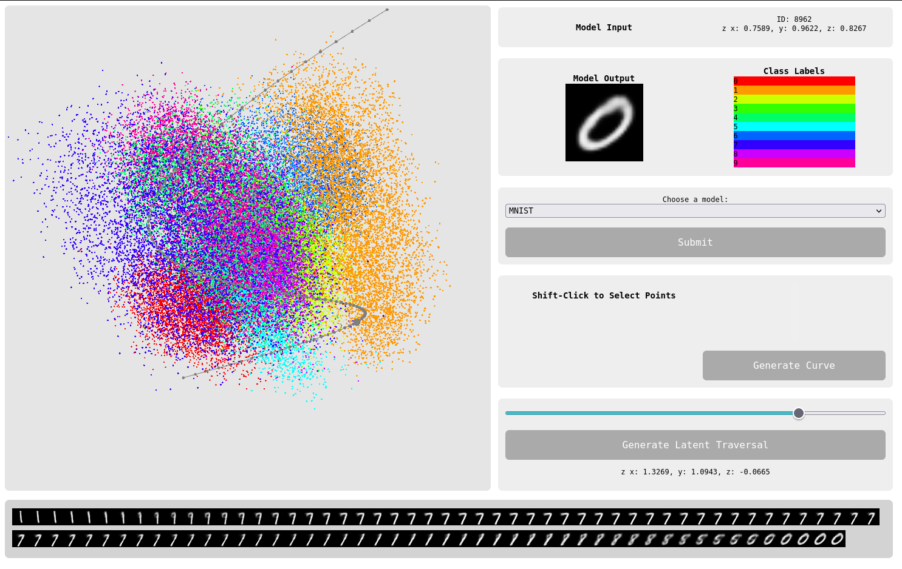
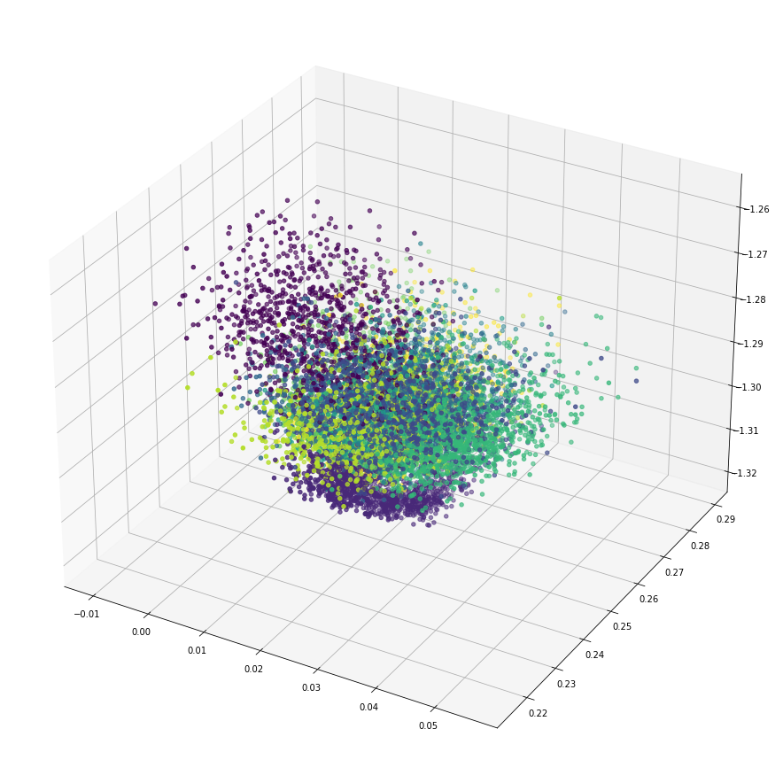

# Interacting with the Latent Space of a VAE

# [Available Online Here](https://interactive-latent-vae.netlify.app/)

Visualising the latent space of a latent variable model (such as a VAE) is often part of the process in learning about how these model work and ultimately how we can then use the model to generate new data. Here is the 3D latent space of a simple VAE visualised using MatplotLib:

I definitely fall into the camp of pretty-visuals-help-me-a-lot and I'm sure plenty of others do as well, and so whenever I am able produce graphs/plots/visualisations I will. I often teach students at UAL about machine learning (mostly on Creative Computing) and visualistions help there a lot too. But one of the trickiest parts to demonstrate is how data moves through a model and how the model itself is largely just reshaping data (add/removing dimensions) through a series of tiny calculations (that's how I see it any way). So it's one thing to visualise the latent space of a model, but still connecting the dots between model input and output can still be confusing.

SO that led me to make this. It's basically an interactive scatterplot of the latent space of a VAE. There are other things like this [out there](https://projector.tensorflow.org/), arguably better, but I wanted to focus on image generation. The starting point really was that I wanted to literally visualise a traversal through latent space - and you can do that with this thing*.

## Features

- Click and drag to rotate the point cloud.
- Scroll in and out to zoom.
- View the XYZ coordinates of each point in latent space using your mouse.
- View the output of the model for each latent coordinate.
- Select a number of latent coordinates and **Generate a Curve** in latent space using these coordinates as control points.
- Generate a latent space traversal using the curve you have plotted.
- *Use the slider to move along the traversal and view the output of the model at each step along the curve.
- Select a class label to highlight those point in the point cloud.
- Load either MNIST or Fashion MNIST models.

## Future Work

This is largely a proof of concept on a technical level. Getting this up and running with WebGL was actually quite painless as it's pretty easy to load a massive NumPy array into JS into WebGL (I used a modified version of [npyjs](https://github.com/aplbrain/npyjs) by [aplbrain](https://github.com/aplbrain)). So something I'd like to do now is export the weights of a model and look into visualising these. I've always been curious about how a 3D map of a model itself would look. Given that weights are normally bound between [-1, 1] or [0, 1] it should be quite trivial and hopefully quite revealing to colour, visualise and _compare_ models. If one was to train the same model multiple times on the same dataset (and achieve the same results), would the insides of each of these models look the same? Are there repetitive traits? If so, could one then bootstrap the training process by laying, or _painting in_ the starting weights of a model?

It would also be great to use this method on bigger more exciting models - like a ProGAN or even StyleGAN - and acutally use the interactive latent space to generate interesing images and video. Or even just explore the latent space in a _more intuitive way_. Although I'm not sure how this would work with a GAN which just samples gaussian noise.. Maybe a Pix2Pix model or a bigger VAE which has some latent representation of the data inside it.

This works as also been a return to [WebGL_Boilerplate](https://github.com/joshmurr/webgl_boilerplate) which I made a couple years ago. __WG_BP__ was an attempt at writing a lightweight WebGL library to make making WebGL demos/experiments quicker and easier - and I was quite happy with it. But actually it absracted a bit too much away and when I tried using it for this it got in the way a bit too much. [gl_handler.ts](https://github.com/joshmurr/js-plot-vae/blob/master/src/gl_handler.ts) is the next version of that it is an attempt to find a nicer balance between WebGL boilerplate code, and also the ability to tap into the WebGL pipeline at any point. Key ideas are:

- The GL_Handler object not handling state - state is managed by the user at root level (you write you're own draw loop).
- GL_Handler is just that, a handler - it handles loading shaders, making textures, setting uniforms, making matrices etc.
- The Geometry class is actually quite similar to how it was before - it is an abstract class and it is down to the user to making their own geometry subclasses.
- Each geometry subclass must declare a `linkProgram()` method which declares the attributes the geometry will use in the relevant program and anything else specific to the geometry. This is a good example as the `latent_points` geometry is basically just a point cloud, but handles more stuff like generating a colour palette and UIDs for picking.
